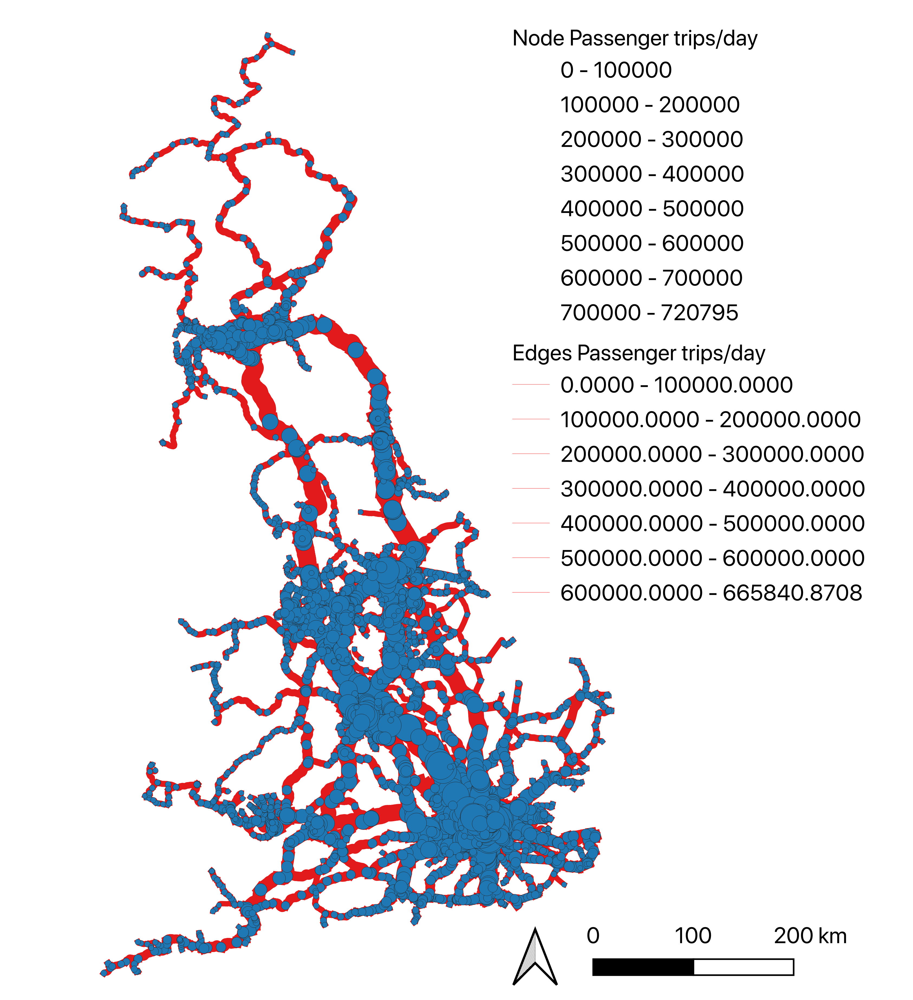

# GB-railway-network-model
A model of the Great Britain (GB) railway network with topology and passenger daily flows.

## Requirements and description

### Python and libraries

Python version 3.6 is required to run the scripts in this project. I suggest using
[miniconda](https://conda.io/miniconda.html) to set up an environment and manage library
dependencies.

### Input data

All input data is stored in a folder `GB_rail_data`, which contains the input data required for running the model.
The input data is organised in sub-folders:
- `timetable`: Train timetable schedules in 2019 released by the [ATOC](http://data.atoc.org/how-to)
	This data is not shared here, because the user should download it from the ATOC website by creating a free login account.
- `usage`: Annual station usage statistics in 2017/18 released by the [ORR](https://dataportal.orr.gov.uk/statistics/usage/estimates-of-station-usage/).
- `network`: A GIS representation of the GB railway network of nodes and edges. The network shows the latest (2019 representation of all stations and routes in the network. Our own creation, using and cleaning raw data from open data resources like OSM, Ordance Survey open data.
- `id_matches`: File that matches the ID columns between the ATOC, ORR and GIS network datasets. Our own creation. 

### Codes and Output data

To run all python scripts first set the input data path on the `script_config.ini` file.
All outputs are generated in the folder path `GB_rail_data/outputs`.

The script `rail_od_flows.py` takes the ATOC, ORR and GIS network datasets and generates a daily passenger (total over 24 hours) OD matrix of flows for the rail network. See the `rail_od_flows.py` script and output file `od_matrix.csv` for details.

The script `assemble_flows.py` takes the OD matrix of flows and calculates the aggregated flows on each network node and edge. See the `assemble_flows.py` script and output file `rail_nodes_flows.shp` and `rail_edges_flows.shp` for details.

## How to update data and results

The code uses 2019 train timetable data and 2017/18 Annual station usage statistcs. These datasets are released every year in the same format. Hence the code can be used for future releases on these datasets. Changes can be made in `rail_od_flows.py` `main()` [lines 458-472] to use new input. 

If a new station with timetables and usage is introduced in the network then the GIS shapefiles and the ID matches will have to also be updated.
Best to retain the same ID column names and data types in future data updates. 

## References

Request the user to cite the model's methodology described in the paper:

    Pant, R., Hall, J. W., & Blainey, S. P. (2016). 
    Vulnerability assessment framework for interdependent critical infrastructures: case-study for Great Britain’s rail network. 
    European Journal of Transport and Infrastructure Research, 16(1). 
    https://doi.org/10.18757/ejtir.2016.16.1.3120

## Visual output

Code output of node and edge flows (passenger trips/day) as visualised on QGIS

## Next steps

This is a work in progress. The model will be updated to perform a failure analysis on the rail network.

## License

This model has been developed at Oxford University, as part of the [ITRC](https://www.itrc.org.uk) project.
All code copyright is licensed MIT (see the `LICENSE` file for details).